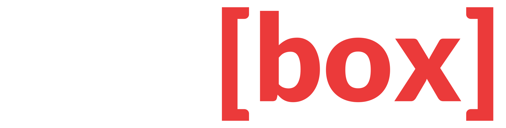

<p align="center">
  
</p>

**Redbox** turns an [Edgeberry](https://github.com/Edgeberry) device into a Node-RED box. It is
an installer and a set of configuration: it puts Node-RED on the device, registers it with
Edgeberry as *the* application, and dresses both the device interface and the Node-RED editor in
the Redbox brand. What the box then *does* is whatever you wire up in the editor.

## Installation

Download and execute the installation script:

```
wget -O install.sh https://github.com/Edgeberry/Redbox/releases/latest/download/install.sh;
chmod +x ./install.sh;
sudo ./install.sh;
```

The editor is at `http://<device>/application/editor` once it finishes.

Removal is `sudo /opt/Redbox/uninstall.sh`. It leaves Node.js, NPM, Node-RED and jq installed —
they are system components, and something else on the device may be using them. It does remove
`/opt/Redbox`, and the flows with it, so export anything worth keeping first.

## What the installer does, and what it deliberately doesn't

Two things in [`scripts/install.sh`](scripts/install.sh) are load-bearing and worth knowing
before changing it:

**Node-RED starts last.** It reads its palette and its flow file once, at startup. Start it
before `npm install` has finished and the install still reports success while Node-RED runs with
an empty palette. The final step waits for Node-RED to say `Started flows` in its own journal,
because `systemctl restart` returns 0 as soon as systemd has spawned the process — a
crash-looping Node-RED reports itself `active (running)` for as long as each attempt lasts.

**Node.js is never upgraded.** It belongs to the whole device: Edgeberry Core runs on the same
`/usr/bin/node`. The installer installs Node.js when it is missing and otherwise leaves it
exactly as found. A version that does not suit Node-RED is reported, and the install stops,
rather than being "fixed" underneath another application.

`NODEREDVERSION` in the script is pinned at **4.1.13** on purpose. Node-RED 5.x needs Node.js
≥ 22.9, and an Edgeberry device runs Debian's Node.js 20. Before raising it, check that both the
palette *and* Edgeberry support the Node.js version the newer line requires.

## The `edgeberry.json` manifest

Redbox runs on an Edgeberry device as *the* application on it, and `edgeberry.json` is how it
describes itself to the device software. The installation script registers it once:

```
sudo edgeberry --register-application /opt/Redbox
```

Only the path is stored. The manifest stays inside the application directory and is re-read on
every start, so shipping a new release updates what the device knows about Redbox without
re-registering. Registration refuses everything and exits non-zero if any part of the file is
invalid, so a packaging mistake surfaces at install time rather than months later.

| Field | What it does |
|---|---|
| `name` | Identifies the application. Slugified, it also names the nginx config Edgeberry generates for it (`redbox.conf`) |
| `version`, `description` | Descriptive metadata about the installed application |
| `ui.port` | The port Node-RED listens on. Everything under `/application/` is proxied here with the prefix stripped, so `http://<device>/application/editor` reaches the Node-RED editor |
| `branding` | Brands the **Edgeberry device interface**: `logo` replaces the Edgeberry logo in its navigation bar, `mark` becomes the browser tab icon, and `colors` (`fg`, `bg`, `primary`) restyle it in Redbox's colours. Paths are relative to the application directory and may not point outside it |
| `service` | The systemd unit Edgeberry may act on, and which lifecycle actions it may perform. Redbox allows `restart`, `stop` and `start`, which is what the Device Hub's buttons drive |

> [!NOTE]
> `branding` styles the Edgeberry device interface around Redbox, not the Node-RED editor
> itself — the editor's own look is the theme in [`nodered/theme`](nodered/theme).

Because nginx strips the `/application` prefix, an **absolute** URL in served markup escapes it
and lands on the device's catch-all. Relative URLs resolve against whatever prefix they are
served under and need no changes; anything that must be absolute should read the
`X-Forwarded-Prefix: /application` header.

## Brand

| | Colour | |
|---|---|---|
| Vivid Crimson | `#EB3A3A` | The brand colour. The brackets, the deploy button, links, primary buttons |
| Carbon black | `#1E1E1E` | Backgrounds — the same carbon the Edgeberry interface uses for its chrome |
| White | `#FFFFFF` | "Red" in the wordmark, on carbon |

The wordmark is **Red[box]** set in **Lato Black (900)**: `Red` in white, `[box]` in Vivid
Crimson. The symbol is `[ ]` — the red box, empty — in Vivid Crimson on carbon.

| Asset | Use |
|---|---|
| [`assets/Redbox_logo.svg`](assets/Redbox_logo.svg) | The wordmark, for dark backgrounds. This is what the Edgeberry navigation bar wears |
| [`assets/Redbox_logo_dark.svg`](assets/Redbox_logo_dark.svg) | The same wordmark with `Red` in carbon, for light backgrounds |
| [`assets/Redbox_mark.svg`](assets/Redbox_mark.svg) | The symbol, on its carbon tile |
| [`assets/favicon.ico`](assets/favicon.ico) | The symbol at 16/32/48/64 px, for browser tabs |

The letterforms in the SVGs are converted to outlines rather than set as live text, so they
render the same on a device with no Lato installed. That does mean the text can't be edited in
place — changing the wordmark means setting it in Lato Black again and re-exporting.

`assets/` is also what Node-RED serves as `httpStatic`, which is how `/favicon.ico` resolves for
the editor.

## Layout

| Path | What it is |
|---|---|
| [`edgeberry.json`](edgeberry.json) | The application manifest Edgeberry reads |
| [`assets/`](assets/) | Brand assets. Served by Node-RED as `httpStatic` |
| [`config/`](config/) | The systemd drop-in for the Node-RED service |
| [`nodered/`](nodered/) | Node-RED's `userDir`: `settings.js`, the palette in `package.json`, and the editor theme |
| [`scripts/`](scripts/) | `install.sh` and `uninstall.sh` |

The release workflow packs `assets/`, `config/`, `nodered/`, `edgeberry.json`, `uninstall.sh`
and the licence into the tarball, and attaches `install.sh` alongside it. `scripts/install.sh`
is fetched on its own and downloads that tarball, so the two are published as separate assets.

## License & Collaboration

**Copyright© 2026 Sanne 'SpuQ' Santens**. Redbox is licensed under the
**[MIT License](LICENSE.txt)**.

### Collaboration

If you'd like to contribute to this project, please follow these guidelines:
1. Fork the repository and create your branch from `main`.
2. Make your changes and ensure they adhere to the project's coding style and conventions.
3. Test your changes thoroughly.
4. Ensure your commits are descriptive and well-documented.
5. Open a pull request, describing the changes you've made and the problem or feature they address.
